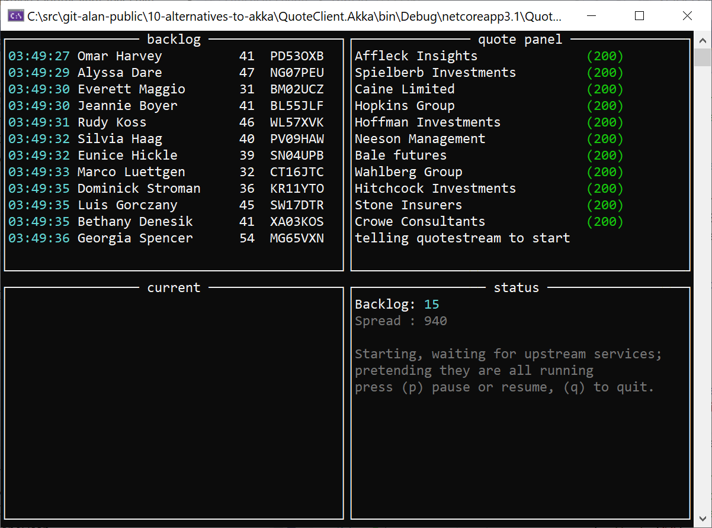

# objectives

code walk through of **circuitbreaker with Akka.net** and (without akka) using **Polly**

## time permitting show a few of these in code

- Polly
- MediatR
- Memstate

## what are we going to simulate?

- car insurance quote finder. A "panel" of API's to get the best quote. `// panel.txt`
- for our demo we'll start 20 services, so that some can hang, and block, all services reliability is  independant of the others.

 Will demonstrate implementing `circuit breaker` on both `Akka.net` vs non akka and `Polly` running as the system starts, by telling an actor to `become` OFFLINE until all the upstream services are online, and monitoring the upstream services. 
 If more than 2 upstream services go offline, then the monitoring actor tells the `QuoteManager` actor to become `OFFLINE` again. And `ONELINE` when enough upstream services are online.

- I will attempt to simulate multiple providers experiencing different types of technical difficulties based on a `Chance` of experiencing difficult that is configured. A list of quote providers configured as so in `panel.json`...

```json
    ...
    {
      "Name": "Hitchcock Investments",
      "Speed": 700,
      "Port": 5117,
      "Availability": "Bad"
    },
    ...
```

Availability of each of the demo services is either `Excellent`, `Good`, `Spotty` and `Bad`. The console app `QuotePanel` launches one self hosted webapi per entry in the panel file, at the configured port, with the configured `speed` and `availability`.

The demo QuoteService is a self hosted .NET Core 3 app, in [QuoteService](/QuoteService). The logic for the demo is in [Controllers/QuoteController.cs](QuoteService/Controllers/QuoteController.cs) and the chance of an api request throwing one of the errors defined above is defined as so

```csharp
        private bool Should()
        {
            switch(_availability)
            {
                case Availability.Excellent: return false;
                case Availability.Good: return (_rnd.Next(100) > 10);
                case Availability.Average: return (_rnd.Next(100) > 30);
                case Availability.Spotty: return (_rnd.Next(100) > 50);
                case Availability.Bad: return (_rnd.Next(100) > 90);
                default: return false;
            }
        }
```


This impacts the % likelihood that a request to any Insurance company in our panel will give us one of these problems;

```shell
  - 429 with  Retry-After 
  - 503 Service Unavailable, a retry should succeed.
  - 404 should return 404 `Not found`, a retry should never succeed.
  - 500 should return 500 `Internal server error`, possibly take the service down permanently. 
```

I have written a rudimentary [BackoffSimulator.cs](QuoteService/Controllers/BackoffSimulator) that will send 429's and take the service offline until a set time has past. (fingers crossed this gives us the behavior we want for the demo.)

To save time I am using `Konsole`, to rapidly mock up a console user interface. (currently the UX library only works on windows because .NET console has not been fully ported to .NET standard yet, volunteers anyone?)

```
var w = new Window();
var left = w.SplitLeft();
var backlog = left.SplitTop('backlog');
var current = left.SplitBottom('current');
var quote = right.SplitTop('quote panel');
var status = right.SplitBottom('status');
...
foreach(var rfq in rfqs) { backlog.WriteLine(rfq.ToString()); }
....
```

... gives us the following type of scrolling windowed console UX for the test code



